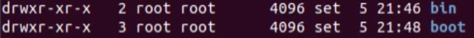
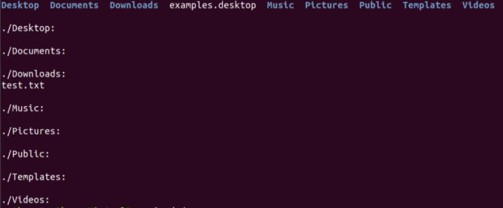
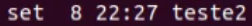
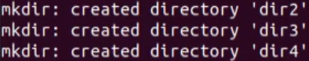
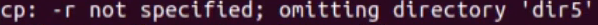
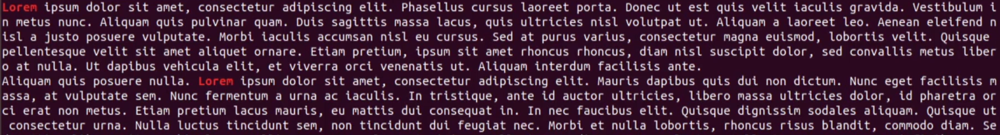

<h1 align = center>Estudo de Linux</h1>

## O que é "terminal" e  "shell"

- É possível abrir o terminal com `ctrl + alt + t`;

- Terminal é a interface gráfica do shell;

- Assim que o comando é executado no terminal, o shell roda ele;

## Sintaxe

- O comando é escrito da seguinte forma: **`COMANDO -OPÇÕES ARQUIVOS/DIRETÓRIOS`**;

- Caso não haja opções, pode se escrito da seguinte forma: **`COMANDO ARQUIVOS/DIRETÓRIOS`**;

## Estrutura de diretórios do Linux

- bin: Pasta que contem arquivos binários;

- boot: arquivos que auxiliam na inicialização do sistema;

- dev: arquivos que representam todos os dispositivos de entrada do sistema;

- etc: arquivos de configuração;

- home: possui o diretório dos usuários;

- lib: contem arquivos de bibliotecas que são compartilhadas entre outros aplicativos;

- media: responsável pelas pastas dos dispositivos montados no pc, por exemplo: usb;

- opt: possui arquivos das aplicações que não são oficiais do sistema;

- sbin: possui arquivos binários de inicialização do sistema;

- tmp: possui arquivos temporários;

- usr: contém arquivos utilizados apenas no modo leitura;

- var: contém arquivos de log;

## Comando `cd`

- O comando é utilizado para navegar entre pastas

- Para navegar para o diretório `/home/<seu nome de usuário>`, use o seguinte comando:

  - `cd /home/<seu nome de usuário>`

- Para navegar para o diretório `/etc`, use o seguinte comando:

  - `cd /etc`

- Para navegar para o diretório anterior, use o seguinte comando:

  - `cd ..`

- Para navegar para o diretório raiz, use o seguinte comando:

  - `cd /`

- O comando `cd -` volta um diretório e mostra qual era o diretório anterior que você estava trabalhando

### Exemplo:

- Você está no diretório `/` utiliza o `cd var`
após isso utilizar o `cd -` você estará no diretório `/` porém se utilizar novamente o `cd -`, irá para o diretório `var` e não para o anterior do sistema, e sim o que você estava trabalhando

### Exemplo no terminal:

`leandro@leandro-VirtualBox:/$ `

`leandro@leandro-VirtualBox:/$ cd etc`

`leandro@leandro-VirtualBox:etc/$ cd -`

`leandro@leandro-VirtualBox:/$ cd -`

`leandro@leandro-VirtualBox:etc/$ `

### Mais estilos de `cd`

- `cd ~` atalho para ir no diretório Users

- É possível concatenar comandos utilizando `&&` exemplo:
    - `cd ~ && ls` Ele irá para a pasta Users e listas todos os diretórios dela

## Comando `ls` básico

- `ls` lista todos os arquivos e pastas

- `ls -l` lista com todos os detalhes:

  A ordem dos detalhes é: permissões de arquivo, usuários e grupo do arquivo, tamanho do arquivo e data de criação do arquivo

- Com o comando `ls -a` é possível listar todos os arquivos inclusive os ocultos

- `ls -ltr` Mostra a ultima data de modificação do arquivo

## Comando `ls` avançado

- É possível listar os arquivos em ordem reversa utilizando o "r", `ls -lr` é o mesmo que `ls -l` porém listando os arquivos na ordem reversa

- `ls -R` lista todos os diretórios e seus sub diretórios e arquivos:

- `ls -lS` lista de acordo com o tamanho do arquivo

- `ls -m` mostra os diretórios separados por virgula

- `ls --help` mostra com detalhes o que pode ser utilizado e o que cada um faz

## Comando `clear`

- `clear` limpa o terminal

## Comando `cat` básico

- É possível criar um arquivo por meio dele ou ver o conteúdo de um arquivo

- `cat teste` mostra o conteúdo do arquivo "teste"

- É possível ver conteúdo de 2 arquivos ao mesmo tempo: `cat teste teste2` mostra o conteúdo de "teste" e "teste2"

- Utilizando o `cat teste teste2 > teste3` ele junta os dois arquivos no "teste3"

- `cat -n teste3` mostra o conteúdo do arquivo e mostra as linhas

## Comando `cat` avançado

- `cat -e teste` delimita com um "$" todo final de linha

- Caso queira adicionar mais conteúdo em um arquivo basta utilizar `cat teste4 >> teste3`

## Comando `touch`

- Cria um arquivo ou modifica a data de alteração dele:
  
  
  
  `touch teste2`

  
  
- Após utilizar o comando `touch` no arquivo "teste2" a hora de modificação foi alterada para a atual

- `touch teste5` caso não haja um arquivo com o nome "teste5" ele irá criar um.

## Comando `man`

- É basicamente o manual do sistema

- `man ls` ele vai mostrar a funcionalidade do comando e seus parâmetros

## Comando `mkdir`

- Cria um diretório

- `mkdir pasta-teste` cria um diretório chamado "pasta-teste"

- É possível criar vários diretórios de uma vez

- `mkdir js css img` cria 3 diretórios, o "js", "css" e "img"

- `mkdir -v dir2 dir3 dir4` cria e específica o que o comando está fazendo:

  

- `mkdir dir2/dir5` cria o diretório "dir2" e dentro dele cria o "dir5"

- Caso haja muitos diretórios a serem criados, Linux dirá que já muitos diretórios e não irá criar, porém utilizando o comando com o `-p` ele cria.
  
  `mkdir dir5/dir6/dir7/dir8`: não funciona
  
  `mkdir -p dir5/dir6/dir7/dir8`: funciona

## Comando `rm`

- É utilizado para remover diretórios e arquivos

- `rm teste.txt` remove o ARQUIVO "teste.txt"

- `rm teste.txt teste2.txt` remove o ARQUIVO "teste.txt" e remove o ARQUIVO "teste2.txt"

- `rm -i teste.txt` pede uma confirmação para remover o arquivo "teste.txt"

- O comando `rm` não remove diretórios sem especificar um parâmetro:
  - `-dv` remove um diretório vazio
  - `-rfv` remove um diretório com conteúdo

- `rm -dv teste` remove o diretório "teste" mesmo que ele esteja vazio

## Comando `rmdir`

- O comando remove apenas diretórios

- `rmdir teste` remove o diretório "teste"
- `rmdir teste/teste2/teste3` remove o diretório "teste", "teste2" e "teste3" que estão dentro de "teste"

## Comando `cp`

- Utilizado para copiar arquivos e diretórios

- `cp doc.txt doc2.txt` copia o "doc.txt" e cria um igual com o nome de "doc2.txt"

- `cp doc.txt teste` copia o arquivo "doc.txt" para a pasta "teste"

- Para copiar um diretório deve utilizar a flag `-r`

- `cp teste teste2` copia o diretório "teste" para o diretório "teste2"

- É possível que quando esteja tentando copiar uma estrutura completa de diretórios e arquivos, ocorra um erro, e a flag `-r` deve ser utilizada

- `cp dir5 dir6`:

- `cp -r dir5 dir6` ele consegue copiar tudo do "dir5" para o "dir6"

- Caso queira copiar tudo dentro de um diretório, basta utilizar: `/*`:

- `cp dir5/* dir6` copia tudo dentro do "dir5" para "dir6"

- O mesmo pode ser feito com apenas um arquivo ou diretório: `cp dir5/teste.txt dir6`: copia o "teste.txt" que está dentro de "dir5" para "dir6"

## Comando `mv`

- Move arquivos e diretórios

- `mv doc.txt docteste.txt`: o arquivo doc.txt deixa de existir e vira "docteste.txt"

- `mv docteste.txt Downloads/`: move o "docteste.txt" para o diretório "Downloads

## Comando `pwd`

- Mostra em qual diretório está

## Atualizando e instalando repositórios

- Para atualizar os repositórios devemos utilizar o `sudo apt-get update`

- Para atualizar os pacotes devemos utilizar o `sudo apt-get upgrade`

- Para instalar pacotes/aplicativos devemos utilizar: `sudo apt-get install <nome-app/pacote>`

- Para remover apps/pacotes utilize: `sudo apt-get purge <nome-app/pacote>`

## Atualizando o Linux

- Para atualizar o Linux devemos utilizar o: `sudo apt-get dist-upgrade`

- Atualizar o Linux pode gerar problemas, pois ele pode remover pacotes que não são do Linux para concluir esta operação

## Limpando pacotes/apps desnecessários

- Utilize o comando: `sudo apt-get autoremove`

## Buscando pacotes/aplicativos

- Utilize o comando: `apt-cache search <nome>`

## Dica **apt-get**

- O apt-get foi resumido para apenas `apt`, qualquer comando que utilize `apt-get` pode utilizar apenas o `apt`: `sudo apt update`

## Comando `head`

- Serve para ver o topo de um arquivo, exemplo:
`head documento.txt` "documento.txt" é um arquivo de 50 parágrafos, com o `head documento.txt` ele mostra apenas o topo do documento

- Com ele também é possível pedir um número x de linhas: `head -n <num-de-linhas documento.txt>`

- É possível acrescentar no final do comando se você deseja colocar a parte do texto em um outro arquivo: `head -n 10 documento.txt > resumo-head-doc.txt`

## Comando `tail`

- O `tail` funciona da mesma maneira que o `head`, porém ele mostra o fim do arquivo

- Sintaxe completa: `tail -n 10 documento.txt > resumo-tail-doc.txt`

- O comando `tail -f <nome-arq>` é utilizado para fazer debug de logs

## Comando `grep`

- Ele procura uma palavra desejada em um arquivo, por exemplo:

  No "documento.txt" existe a palavra "Lorem"
  
  Utilizando o comando: `grep 'Lorem' documento.txt` ele vai mostrar aonde tem a palavra e dar um **highlight** nela.
  

  **Atenção** o comando `grep` é Case Sensitive, ou seja, palavras com inicial em maiúsculo fazem diferença. Porém podemos utilizar a flag `-i` para perder esta característica: `grep -i`

- `grep -c`: Fala quantas vezes ele achou a palavra que procuramos.

- `grep 'Lorem' -r`: Irá procurar em todos os arquivos a palavra desejada

## Comando `find`

- `find -name 'documento.txt'`: procura todos os arquivos com o nome selecionado

  **Atenção** o comando `find` é Case Sensitive, ou seja, palavras com inicial em maiúsculo fazem diferença. Porém podemos utilizar a flag `-iname` para perder esta característica: `find -iname`

- `find -empty`: Procura arquivos e diretórios vazios

  É possível separar por diretórios e arquivos:

  "d" = diretório> `find -empty -type d`
  
  "f" = arquivo: `find -empty -type f`

## Comando `locate`

- O comando busca arquivos/diretórios em uma base de dados local, pode ocorrer de arquivos muito novos não serem encontrados

- Sintaxe: `locate <nome-arquivo>`

- É possível ver como está a base de dados utilizando: `locate -s`

## Comando `which`

- É possível ver de onde um comando sai utilizando: `which <nome-comando>`